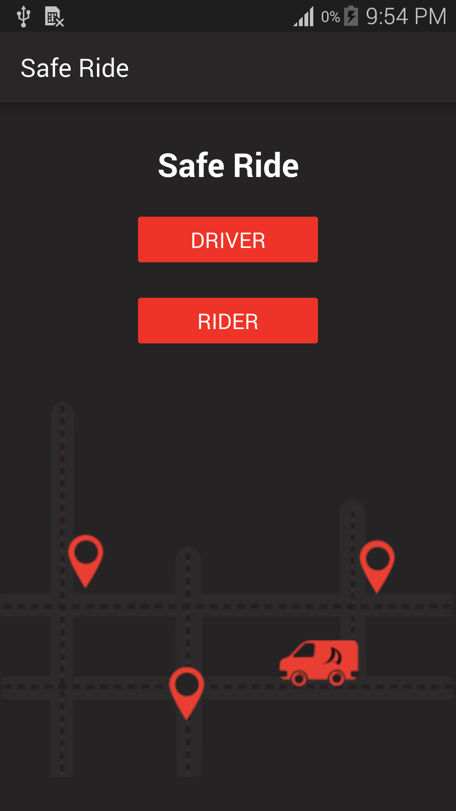
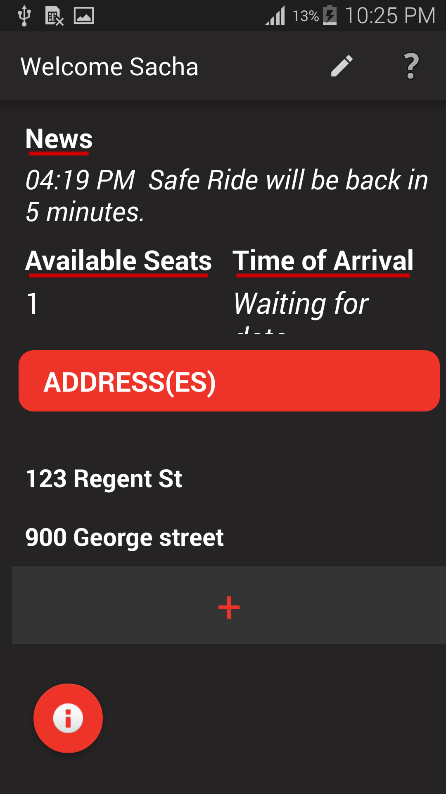
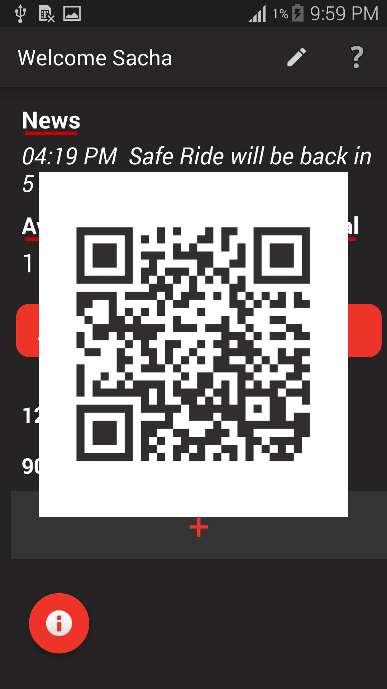
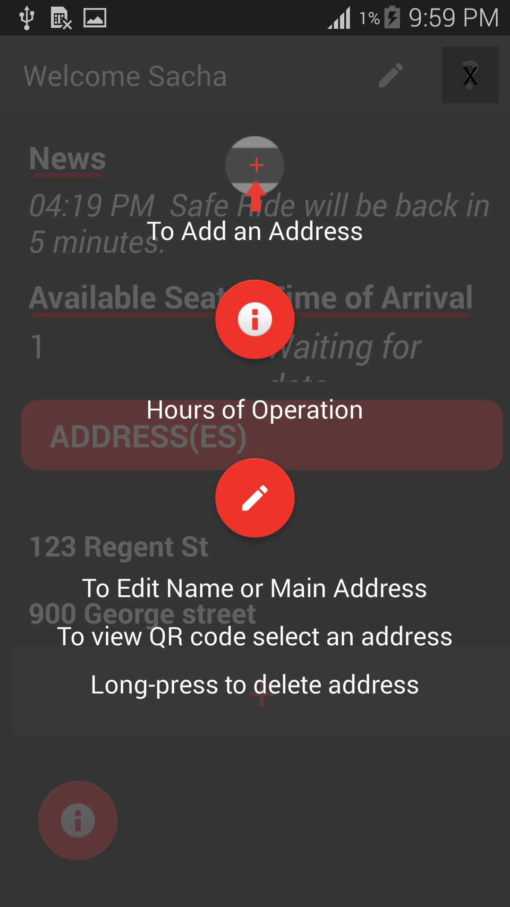
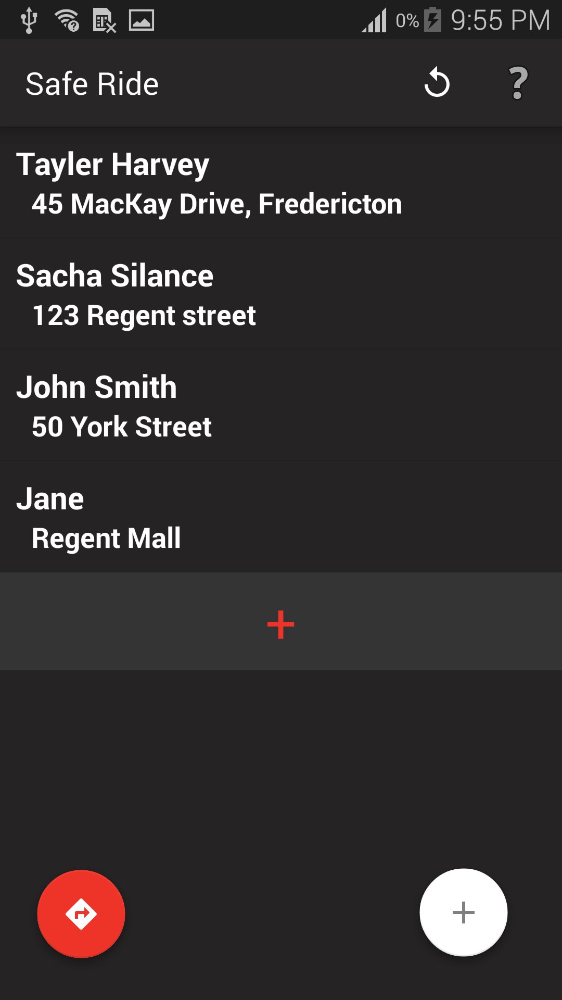
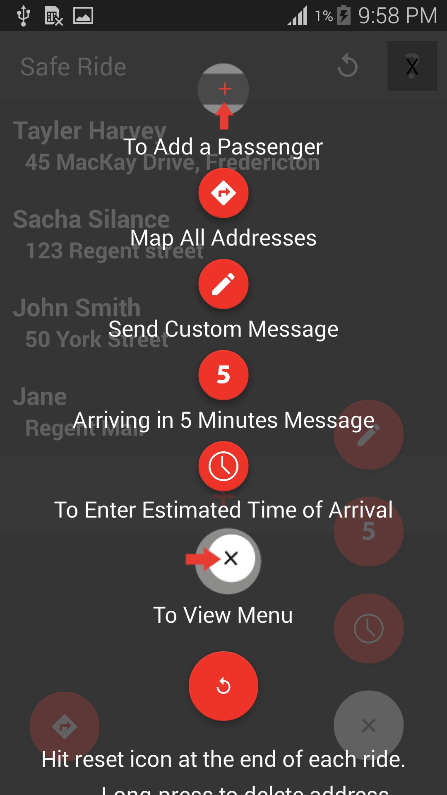

# SafeRide
  
	
## Introduction
The purpose of our mobile app is to improve the current SafeRide system. SafeRide is a UNB run system that picks up a number of students from specific locations on campus and drops them off to their respective homes. Currently,  there  is  very  little  to  no  information  about  departure  or  arrival  times  on  the Internet. A SafeRide user must be at the physical location to see the information posted on a whiteboard which is not always accurate or visually see if the ride is there or not. The process is inefficient in the sense that the driver must guess the arrival time but also exit the  van  to  update  the  board.  Another inefficiency  of  the  current  system  is  that  the  driver must also remember x number of addresses and is required to mentally map out the best route. There is no app for the SafeRide at UNB at the moment. This app will be designed and implemented mostly for the driver and a read-only version for the SafeRide users. 

### Limitations and requirements
This application was solely designed for mobile phones and not tablets.

For  the  purpose  of  this  project,  instead  of  having  2  apps,  the  app  includes  the driver  and  rider  on  the  main  page.
Ideally,  if  this  were  to  be  launched, there would  be  a  separate  app  for  the  driver  and  one  for  rider  with  some sign-in process.

An Internet connection is needed to view Google Maps and to receive and send notifications.

## How to use SafeRide 
We have included help buttons for the driver and rider, they can be found inthe menu bar. Check them out to know what to do but here is some extra info.

### Rider flow 
You will be asked to created your profile and set up your address upon entering the rider side.
The main page includes information about available seats, time of arrival and news. It also contains the user's saved addresses

  

To join the ride simply tap the address you want. A QR code will show up on your screen, show this to your Driver and they will be able to scan it with their app.

>  

Tap the question mark to view the help overlay

  

### Driver flow
The main driver page includes a list with all the passengers, the "directions" button on the bottom left is a quick way to open Google Maps with all addresses loaded in.
To add an address, click  on  the  bar  with  the  red  plus. You can then choose your method of adding the address (QR code scan or manual).
To delete an address, long press on the address.
You can tap a single address to view a map if you need directions.
We have arbitrarily chosen a maximum of 5 riders per ride.
Drivers can also send custom notifications to  riders and  set  ETA’s  using  the floating ActionButtons on the bottom right.
Upon completion of a ride, the driver is encouraged to hit reset, to delete all items but more importantly this resets the available seats for the next ride and announces that the van is loading

  

Tap the question mark to view the help overlay

  

